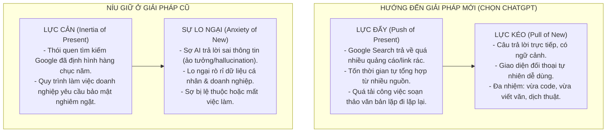

# Phân Tích Phân Khúc Người Dùng & JTBD của ChatGPT

## 🎯 Mục tiêu
Xác định chính xác **ai đang thật sự dùng ChatGPT và họ thuê sản phẩm này để giải quyết công việc (Job) gì**, từ đó phân tích hành trình chuyển dịch từ nhóm người dùng đầu tiên (Early Adopters) sang tệp người dùng đại chúng hiện tại.

---

## 📊 Bảng so sánh Early Adopters vs Tệp User Hiện Tại của ChatGPT

| Tiêu chí | Early Adopters (Người dùng sớm - Cuối 2022) | Tệp User Hiện Tại (Người dùng đại chúng - Hiện nay) |
| :--- | :--- | :--- |
| **Đặc điểm & Chân dung** | - Các lập trình viên (frontend/backend dev), người làm công nghệ (tech enthusiasts). - Copywriter, người sáng tạo nội dung số (content creator). - Học sinh, sinh viên nhạy bén công nghệ. - Thường xuyên hoạt động trên Twitter (X), Reddit (r/ChatGPT), Hacker News. | - Nhân viên văn phòng (HR, Marketing, Sales, Admin). - Giáo viên, giảng viên, nghiên cứu sinh. - Lãnh đạo, quản lý doanh nghiệp vừa và nhỏ. - Người dùng phổ thông không chuyên về công nghệ. |
| **JTBD chính** *(Jobs-to-be-Done)* | - **Viết code mẫu & Debug nhanh:** Tìm lỗi cú pháp hoặc sinh mã nguồn nhanh mà không cần tra cứu nhiều trang trên Stack Overflow. - **Lên ý tưởng & Viết nháp hàng loạt:** Tạo sườn bài viết, viết email lạnh (cold email) hoặc bài đăng mạng xã hội nhanh để tăng năng suất. | - **Soạn thảo văn bản chuyên nghiệp:** Viết email báo cáo, tờ trình, đề xuất dự án một cách lịch sự, chuẩn mực. - **Tóm tắt & Xử lý thông tin:** Đọc hiểu nhanh tài liệu dài, tóm tắt biên bản họp, dịch thuật đa ngôn ngữ. - **Trợ lý tư vấn & Học tập:** Giải thích các khái niệm khó theo mức độ dễ hiểu mong muốn (như trẻ 5 tuổi), gợi ý ý tưởng kinh doanh. |
| **Cách dùng cũ** *(Trước khi có ChatGPT)* | - Tìm kiếm Google, đọc tài liệu API, tìm code trên GitHub/Stack Overflow. - Tự viết nháp thủ công, suy nghĩ ý tưởng từ đầu mà không có khung sườn sẵn. | - Tự soạn thảo email (tốn nhiều thời gian căn chỉnh từ ngữ). - Sử dụng Google Translate (dịch thô, thiếu tự nhiên). - Đọc toàn bộ tài liệu dài hoặc tìm kiếm thủ công trên Google. |
| **Cột mốc dịch chuyển** | **Cột mốc kích hoạt sự chuyển dịch:** 1. **Tháng 3/2023 (Ra mắt GPT-4):** Khả năng tư duy logic và độ chính xác tăng vượt trội. 2. **Tháng 5/2023 (Ra mắt App Store iOS/Android):** Đưa AI tiếp cận người dùng di động đại chúng. 3. **Sự bùng nổ truyền thông xã hội:** Hiệu ứng truyền miệng lan truyền nhanh chóng từ giới công nghệ sang môi trường văn phòng. |

---

## ⚙️ Phân tích Lực Đẩy & Lực Cản Chuyển Đổi (4 Forces Framework)

Mô hình 4 Lực thúc đẩy dưới đây lý giải hành vi người dùng khi quyết định từ bỏ các phương pháp cũ để chuyển sang "thuê" ChatGPT giải quyết công việc của họ.

### Chi tiết các lực đẩy và cản:

1. **Lực Đẩy (Push of Present):** 
   - Việc tìm kiếm câu trả lời trên Google Search ngày càng mất nhiều thời gian do SEO bẩn và quảng cáo. Người dùng phải bấm vào hàng chục link để tự tổng hợp câu trả lời.
   - Áp lực từ khối lượng công việc hàng ngày đòi hỏi thời gian xử lý nhanh hơn.

2. **Lực Kéo (Pull of New):**
   - Trải nghiệm nhận kết quả dạng văn bản hoàn chỉnh ngay lập tức và có thể trò chuyện để tinh chỉnh nội dung.
   - ChatGPT hỗ trợ định dạng sẵn bảng biểu, code block, giúp tiết kiệm thời gian đáng kể.

3. **Sự Lo Ngại (Anxiety of New):**
   - Người dùng sợ thông tin ChatGPT đưa ra bị sai lệch (hallucination) ảnh hưởng đến uy tín công việc.
   - Lo sợ vấn đề bảo mật thông tin khi nhập các dữ liệu nhạy cảm của dự án lên chatbox.

4. **Lực Cản / Thói Quen (Inertia of Present):**
   - Quá quen thuộc với việc tự viết tay hoặc sử dụng các công cụ tìm kiếm truyền thống.
   - Chưa biết cách viết prompt đúng cách nên dễ nản lòng ở những lần thử đầu tiên khi kết quả chưa như ý.
